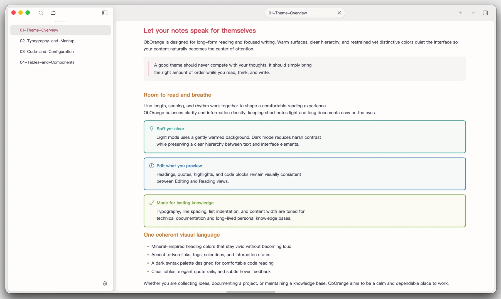
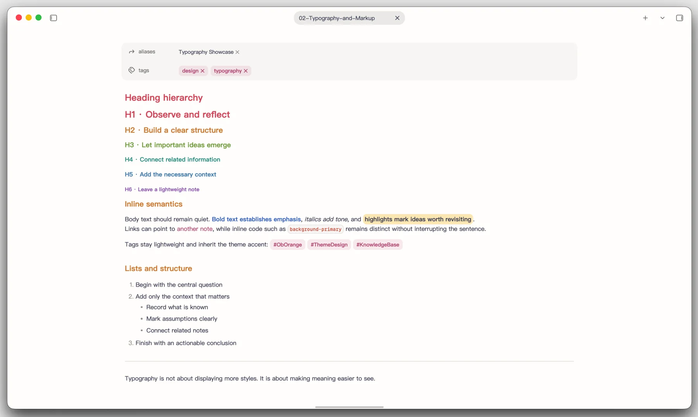
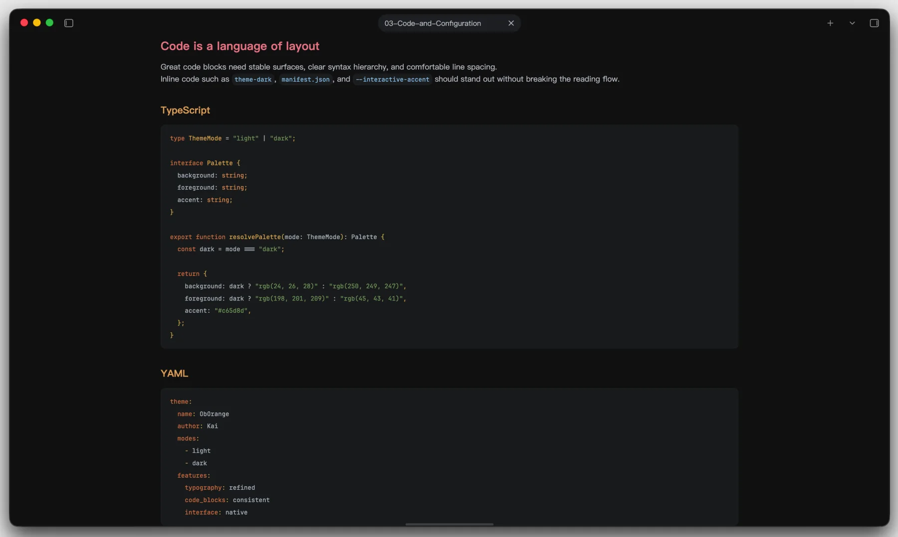
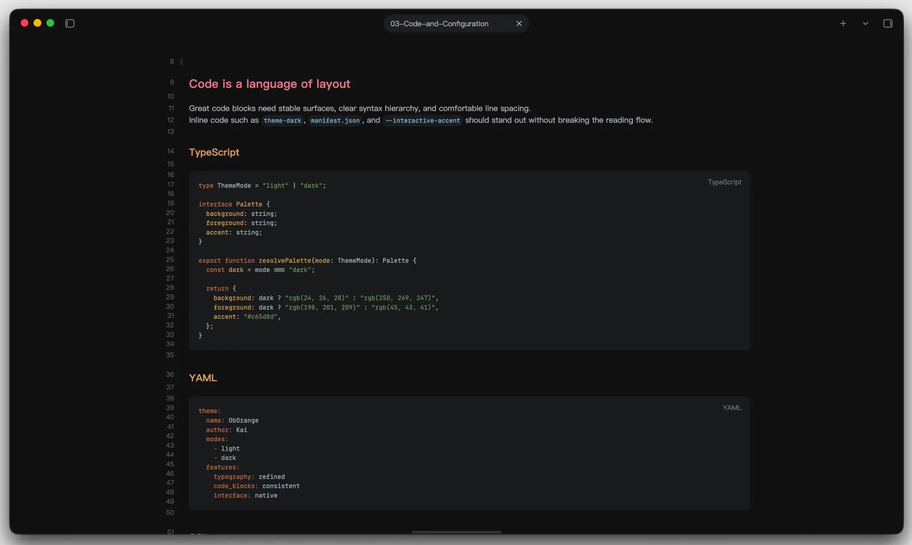
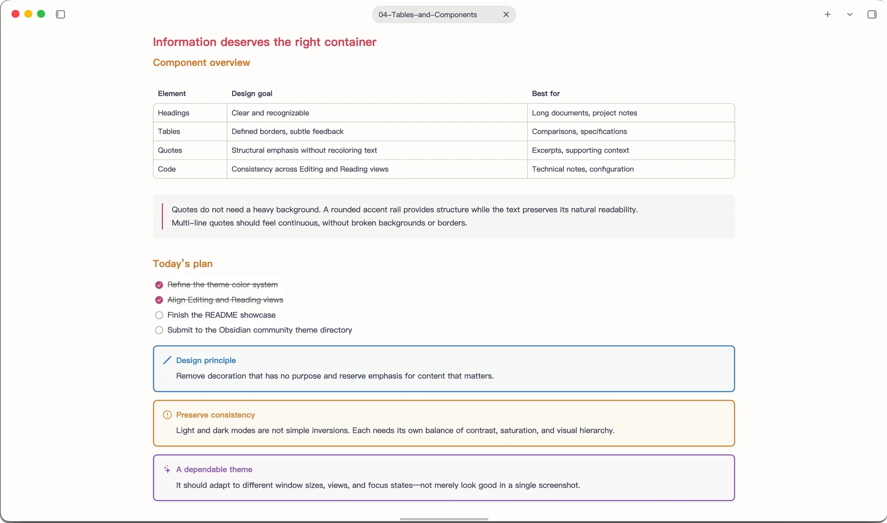
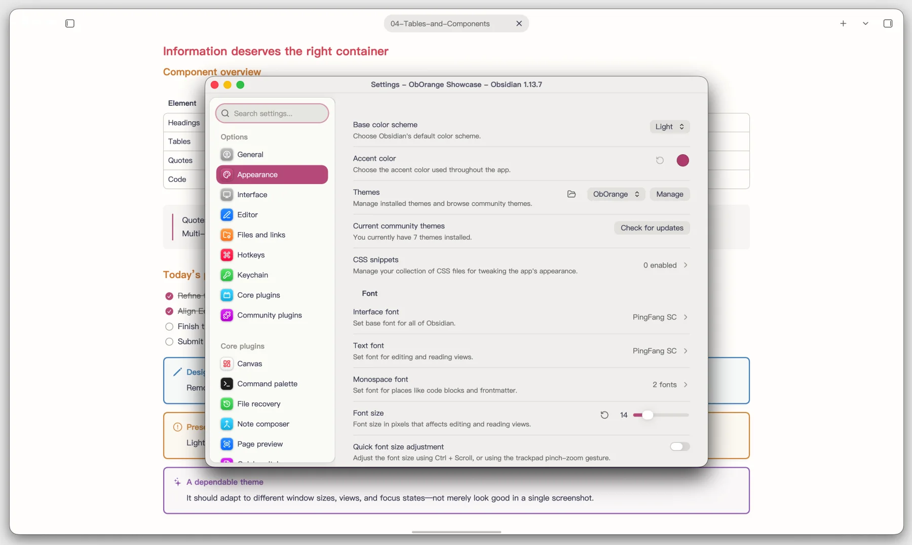
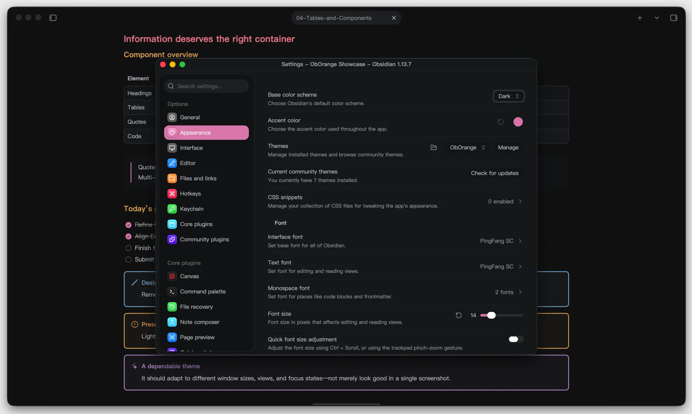

<div align="center">

# ObOrange

### A calm, expressive Obsidian theme for reading, writing, and technical notes

[](https://github.com/kkdove2011/ObOrange/releases/latest)
[](https://obsidian.md/)
[](LICENSE)

ObOrange combines a warm, paper-like light mode with a focused, IDE-inspired
dark mode. Its mineral-colored headings, carefully balanced typography, and
consistent Editing and Reading views keep the interface quiet while giving
your notes a distinct visual identity.

<picture>
  <source media="(prefers-color-scheme: dark)" srcset="https://raw.githubusercontent.com/kkdove2011/ObOrange/HEAD/assets/readme/hero-dark.webp">
  <source media="(prefers-color-scheme: light)" srcset="https://raw.githubusercontent.com/kkdove2011/ObOrange/HEAD/assets/readme/hero-light.webp">
  
</picture>

</div>

## Highlights

- Warm, low-glare light surfaces and a deep charcoal dark workspace
- A vivid mineral palette across H1–H6, tuned independently for each mode
- Matching styles in Live Preview and Reading view
- Purpose-built fenced code blocks and restrained inline code
- Refined tables, callouts, quotes, highlights, tags, and task lists
- Comfortable line length, spacing, and indentation for long-form notes
- Polished sidebars, settings dialogs, tabs, focus states, and transparency
- Optional customization through the Style Settings community plugin

## Typography with a clear voice

Headings move through coral, amber, green, teal, blue, and violet. The palette
creates a recognizable hierarchy without overpowering body text, while inline
markup stays easy to scan.



## Code that reads consistently

Fenced code blocks use the same carefully balanced syntax palette in Reading
view and Live Preview. YAML, TypeScript, SQL, and other technical content sit on
a stable charcoal surface with clear token separation.

| Reading view | Live Preview |
| :--: | :--: |
|  |  |

## Components with purpose

Tables use defined but unobtrusive borders, quotes retain the natural text
color, and callouts inherit coordinated tones from the same heading palette.



## A polished Obsidian interface

ObOrange extends beyond Markdown. Settings, navigation, tabs, controls, window
transparency, and focus states are tuned as one system in both color schemes.

| Light mode | Dark mode |
| :--: | :--: |
|  |  |

## Installation

### Community Themes

Once ObOrange is available in the Obsidian Community Themes directory:

1. Open **Settings → Appearance**.
2. Select **Manage** next to Themes.
3. Search for **ObOrange**, then select **Install and use**.

Updates installed through the community directory can be managed directly from
Obsidian.

### Manual installation

1. Download `manifest.json` and `theme.css` from the
   [latest release](https://github.com/kkdove2011/ObOrange/releases/latest).
2. Create this directory inside your vault:

   ```text
   <Vault>/.obsidian/themes/ObOrange/
   ```

3. Place both downloaded files in that directory:

   ```text
   ObOrange/
   ├── manifest.json
   └── theme.css
   ```

4. Reload Obsidian and choose **ObOrange** under **Settings → Appearance → Themes**.

Manual installations are not updated automatically. Download and replace the
two files when a new release is published.

## Optional customization

Install the [Style Settings](https://github.com/mgmeyers/obsidian-style-settings)
community plugin to access the customization options inherited from Cupertino,
including interface details, typography controls, and layout preferences.

## Design foundations

ObOrange is built on the excellent
[Cupertino](https://github.com/aaaaalexis/obsidian-cupertino) theme by
[aaaaalexis](https://github.com/aaaaalexis), with code-color inspiration from
[Drake Typora Theme](https://github.com/liangjingkanji/DrakeTyporaTheme) by
liangjingkanji. ObOrange adds its own palette, Markdown treatments, dark-mode
system, Chinese typography refinements, and application-level fixes.

## Releases and updates

Every tagged release publishes the files Obsidian needs:

- `manifest.json`
- `theme.css`

For maintainers, update the version in `manifest.json`, push the commit, then
create and push a matching tag without a `v` prefix:

```bash
git tag <version>
git push origin master <version>
```

The GitHub Actions release workflow validates the version and attaches the
theme files automatically.

## License

ObOrange is released under the [MIT License](LICENSE). The upstream projects
credited above are also distributed under the MIT License.

---

<div align="center">
  Made with care for focused writing and lasting knowledge.
</div>
